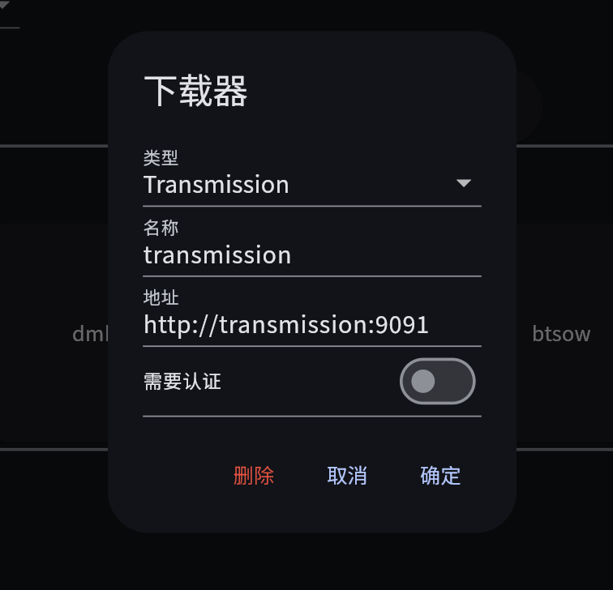
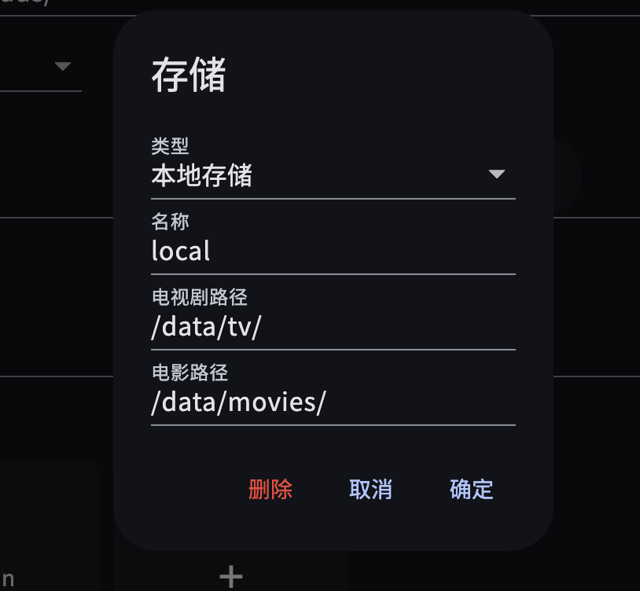

# 配置

要正确使用此程序，需要配置好以下设置：

### TMDB设置
1. 因为此程序需要使用到 TMDB 的数据，使用此程序首先要申请一个 TMDB 的 Api Key. 申请教程请 google [tmdb api key申请](https://www.google.com/search?q=tmdb+api+key%E7%94%B3%E8%AF%B7)

2. 拿到 TMDB Api Key之后，请填到 *设置 -> 常规设置 -> TMDB Api Key里*

### 索引器

索引器是资源提供者，目前支持 torznab 协议，意味着 polarr 或者 jackett 都可以支持。请自行部署相关程序，或者使用的 docker compose 配置一起拉起

推荐使用 linuxserver 的镜像：https://docs.linuxserver.io/images/docker-jackett/

#### 索引器配置

索引器配置这里以 jackett 为例。使用默认 docker compose 配置拉起后以 http://< ip >:9117 可访问 jackett 的主页。

1. 打开 jackett 主页后，点击页面上面的 Add indexer，会出现 BT/PT 站点列表，选择你需要的站点点击+号添加。如果是PT，请自行配置好相关配置

2. 添加后主页即会显示相应的BT/PT站点，点击 *Copy Torznab Feed* 即得到了我们需要的地址

3. 回到我们的主程序 Polaris 当中，点击 *设置 -> 索引器设置* -> 点击+号增加新的索引器，输入一个名称，拷贝我们第2步得到的地址到地址栏

4. 选相框中我们可以看到，还需要一个 API Key，我们回到 Jackett 中，在页面右上角，复制我们需要的 API Key：

5. 恭喜！你已经成功完成了索引器配置。如需要更多的站点，请重复相同的操作完成配置

### 下载器

资源下载器，目前可支持 tansmission，请配置好对应配置

### 存储设置

默认配置了名为 local 的本地存储，如果你不知道怎么配置。请使用默认配置

类型里选择 webdav 可以使用 webdav 存储，配合 alist/clouddrive 等，可以实现存储到云盘里的功能。

