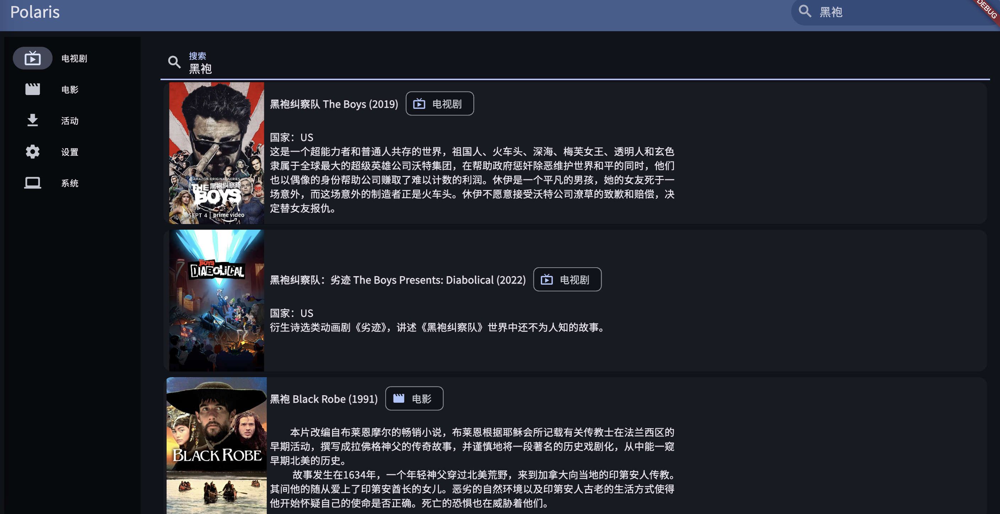
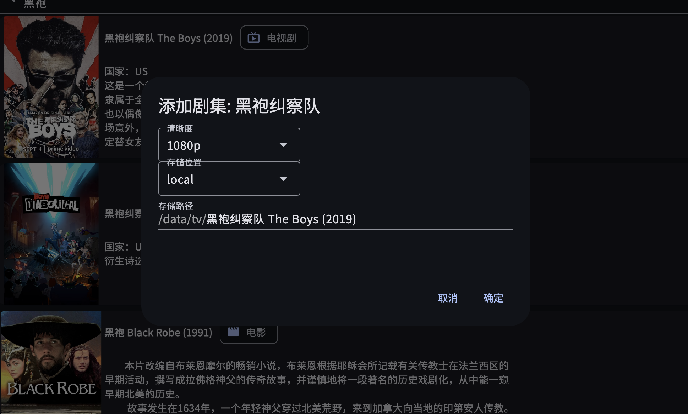

## 快速开始

最简单部署 Polaris 的方式是使用 docker compose，Polaris要完整运行另外需要一个索引客户端和一个下载客户端。索引客户端支持 polarr 或 jackett，下载客户端目前只支持 transmission。

下面是一个示例 docker-compose 配置，为了简单起见，一起拉起了 transmission 和 jackett，你也可选择单独安装

 **注意：** transmission 的下载路径映射要和 polaris 保持一致，如果您不知道怎么做，请保持默认设置。

```yaml
services:
  polaris:
    image: ghcr.io/simon-ding/polaris:latest
    restart: always
    volumes:
      - ./config/polaris:/app/data #程序配置文件路径
      - /downloads:/downloads #下载路径，需要和下载客户端配置一致
      - /data:/data #媒体数据存储路径，也可以启动自己配置webdav存储
    ports:
      - 8080:8080
  transmission:    #下载客户端，也可以不安装使用已有的
    image: lscr.io/linuxserver/transmission:latest
    environment:
      - PUID=1000
      - PGID=1000
      - TZ=Asia/Shanghai
    volumes:
      - ./config/transmission:/config
      - /downloads:/downloads #此路径要与polaris下载路径保持一致
    ports:
      - 9091:9091
      - 51413:51413
      - 51413:51413/udp
  jackett:      #索引客户端，也可以不安装使用已有的
    image: lscr.io/linuxserver/jackett:latest
    environment:
      - PUID=1000
      - PGID=1000
      - TZ=Asia/Shanghai
    volumes:
      - ./config/jackett:/config
    ports:
      - 9117:9117
    restart: unless-stopped
```

拉起之后访问 http://< ip >:8080 的形式访问


## 配置

详细配置请看 [配置篇](./configuration.md)


## 开始使用

1. 完成配置之后，我们就可以在右上角的搜索按钮里输入我们想看的电影、电视剧。
  

2. 找到对应电影电视剧后，点击加入想看列表
  

3. 当电影有资源、或者电视剧有更新时，程序就会自动下载对应资源到指定的存储。对于剧集，您也可以进入剧集的详细页面，点击搜索按钮来自己搜索对应集的资源。


到此，您已经基本掌握了此程序的使用方式，请尽情体验吧！


